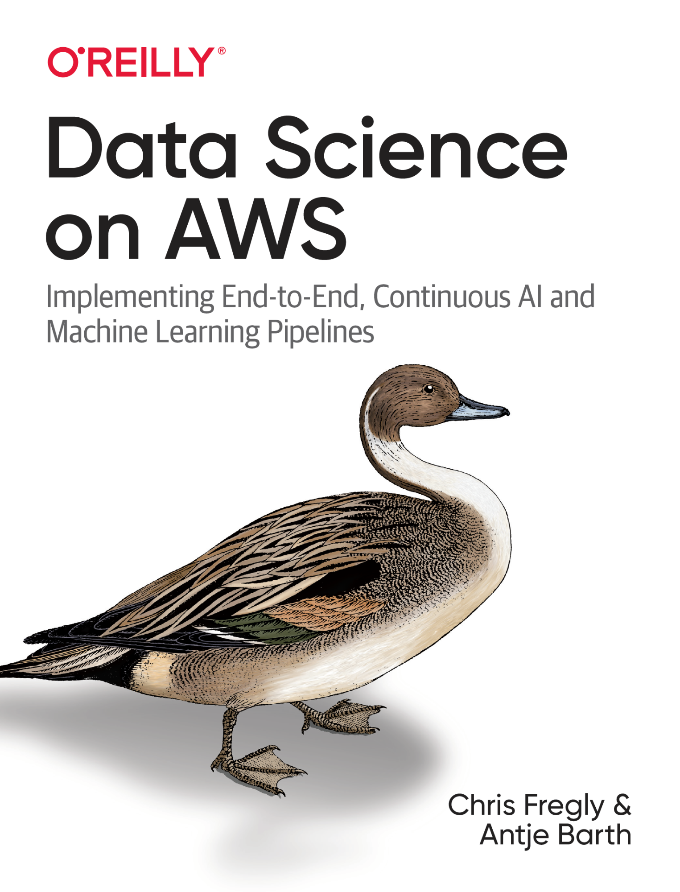
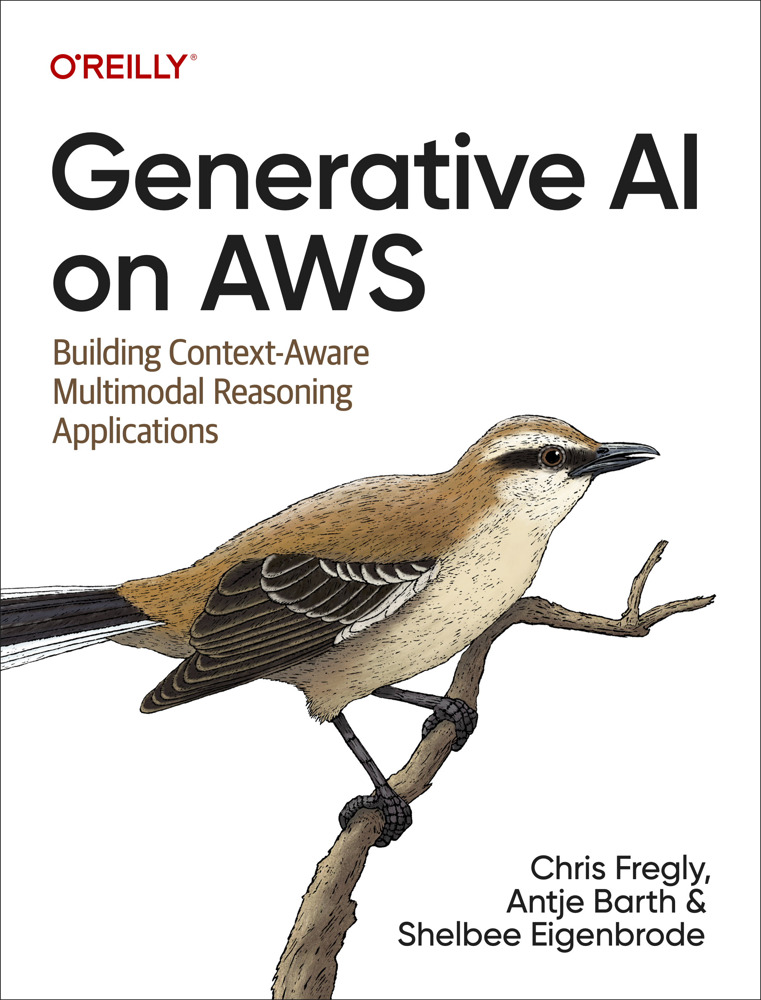

# Data Science on AWS

**O'Reilly Books by Chris Fregly and Antje Barth**

[datascienceonaws.com](https://www.datascienceonaws.com)

---

## Books

<table>
<tr>
<td align="center" width="50%">

 
<strong>Data Science on AWS</strong>
 
<em>Implementing End-to-End, Continuous AI and Machine Learning Pipelines</em>
  
<a href="https://www.amazon.com/dp/1492079391/">Get the Book</a>
</td>
<td align="center" width="50%">

 
<strong>Generative AI on AWS</strong>
 
<em>Building Context-Aware Multimodal Reasoning Applications</em>
  
<a href="https://www.amazon.com/Generative-AI-AWS-Multimodal-Applications/dp/1098159225/">Get the Book</a>
</td>
</tr>
</table>

---

## Authors

### Chris Fregly

Principal Solution Architect for AI and Machine Learning at Amazon Web Services (AWS) based in San Francisco, California. Co-author of the O'Reilly Book, "Data Science on AWS."

Founder of the global meetup series titled, "Data Science on AWS." Regularly speaks at AI and Machine Learning conferences across the world including O'Reilly AI, Open Data Science Conference (ODSC), Big Data London, Big Data Spain, and Nvidia GPU Technology Conference (GTC).

Previously founder at PipelineAI where he worked with many AI-first startups and enterprises to continuously deploy ML/AI Pipelines using Apache Spark, Kubernetes, TensorFlow, Kubeflow, Ray, Amazon EKS, and Amazon SageMaker.

[LinkedIn](https://linkedin.com/in/cfregly) | [X @cfregly](https://twitter.com/cfregly) | [YouTube](https://youtube.datascienceonaws.com)

 

### Antje Barth

Principal Developer Advocate for AI and Machine Learning at Amazon Web Services (AWS) based in San Francisco, California. Co-author of the O'Reilly Book, "Data Science on AWS."

Co-founder of the global "Data Science on AWS" Meetup. Frequently speaks at AI and Machine Learning conferences and meetups around the world, including the O'Reilly AI and Strata conferences. Besides ML/AI, passionate about helping developers leverage Big Data, container and Kubernetes platforms in the context of AI and Machine Learning.

Previously worked in technical evangelism and solutions engineering at MapR and Cisco where she worked with many companies to build and deploy cloud-based AI solutions using AWS and Kubernetes.

[LinkedIn](https://www.linkedin.com/in/antje-barth/) | [X @anbarth](https://twitter.com/anbarth) | [YouTube](https://youtube.datascienceonaws.com)

 

---

## Popular Talks

<table>
<tr>
<td width="50%">

### Reduce LLM Toxicity with PEFT and RLHF
`Generative AI` `Machine Learning`

Toxicity and hate speech have no place in modern society. Learn how to combine parameter efficient fine tuning (PEFT) with reinforcement learning from human feedback (RLHF) for lightweight detoxification of an LLM on a single GPU.

</td>
<td width="50%">

### Fine-Tuning Pipeline for Generative LLMs
`Generative AI` `Machine Learning`

Build an end-to-end pipeline to fine-tune and deploy a generative large-language model using Amazon SageMaker. Includes feature engineering, supervised-fine tuning (SFT), PEFT, model evaluation, and deployment.

</td>
</tr>
<tr>
<td width="50%">

### Scaling AI with Ray on AWS and Kubernetes
`AI and Machine Learning` `Open Source`

Explains distributed Ray and how it differs from Dask and Apache Spark. Covers tips for optimizing Ray on AWS and Kubernetes, plus AWS contributions to the open source Ray project.

</td>
<td width="50%">

### End-to-End Pipeline with BERT and SageMaker
`AI and Machine Learning` `NLP`

Build an end-to-end AI/ML pipeline for natural language processing. Covers data ingestion, visualization, feature engineering, custom BERT training, hyper-parameter optimization, and deployment.

</td>
</tr>
<tr>
<td width="50%">

### Quantum Machine Learning
`AI and Machine Learning` `Quantum Computing`

Demystifies quantum mechanics, quantum computing, and quantum machine learning. Discusses fundamentals, various quantum ML algorithms, and hybrid quantum-classical approaches.

</td>
<td width="50%">

### Multi-Armed Bandit with BERT Reynolds
`AI and Machine Learning` `Reinforcement Learning`

Train and deploy multiple NLU models and compare them in live production using reinforcement learning to dynamically shift traffic to the winning model.

</td>
</tr>
<tr>
<td width="50%">

### Amazon SageMaker AutoPilot
`AI and Machine Learning` `AutoML`

Introduction to Amazon SageMaker Autopilot, a fully managed AutoML service that generates ML models with complete control and visibility into the process.

</td>
<td width="50%">

### Owning Your Own (Data) Lake House
`Big Data` `Analytics`

Introduction to the Amazon Redshift lake house architecture enabling queries across data warehouse, data lake, and operational databases for faster insights.

</td>
</tr>
</table>

---

## Links

- [Workshop Code on GitHub](https://github.com/data-science-on-aws/workshop)
- [YouTube Channel](https://youtube.datascienceonaws.com)
